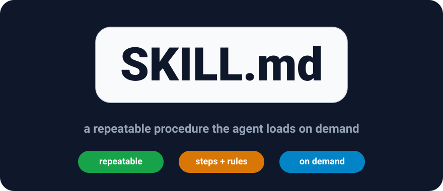

+++
date = '2026-09-09T09:00:00+07:00'
draft = false
pinned = true
title = 'Give your AI agent skills: what SKILL.md is and when to use it'
description = 'A prompt describes one answer; a skill describes a repeatable procedure. Learn the SKILL.md convention for giving agents reusable know-how — the anatomy, a minimal example, and when a skill beats a prompt or RAG.'
summary = 'A prompt describes one answer; a skill packages a repeatable procedure. The anatomy of a SKILL.md skill, a minimal example, and when to reach for one.'
featured_image = 'cover.svg'
show_reading_time = true
+++

An agent does more than chat: it acts — it writes, files, reviews, and fixes things across several steps. Doing any of that well takes a procedure, not just intelligence. The smartest model still needs to know your steps, your rules, your tools, and your output format. If that procedure is stable and you run it over and over, you should not have to retype it every time. That is what agent skills are for: know-how you hand the agent once, so it can run it on demand.



*Cover: a skill is a repeatable procedure the agent loads when the task matches.*

## What an agent skill is

An agent skill — the SKILL.md convention popularized by Anthropic and now supported by several agent frameworks — is a folder that packages one repeatable capability. At its heart is a single markdown file, `SKILL.md`, that tells the agent how to do the task. Around it you can add whatever the procedure needs: reference documents, scripts, templates, or checks.

Skills stay out of the way until needed. The agent usually sees a directory of available skills with only their names and short descriptions; when a task matches a description, it loads that folder and follows the steps. Nothing is stuffed into the system prompt, so every conversation starts lean and the right procedure appears exactly when it is relevant.

Think of a skill as a runbook handed to a careful new teammate: the prompt is *how to say something now*, a skill is *how to do something, every time*.

## The anatomy of a SKILL.md

A good skill file is small and explicit. The parts that matter:

- **Name and description** (front matter). The description is the trigger: agents read it when deciding whether a skill applies. Say what it does *and* when to use it — "Use when asked to translate content" is far more useful than "Translates content."
- **Numbered steps**. The procedure in order. If step two depends on step one, say so.
- **Rules and limits**. What to do, what never to do, and when to stop and ask instead of guessing.
- **Output contract**. Format, length, tone, language, and where the result should go.
- **Supporting files**. Anything the steps rely on that would bloat the instruction file.

A minimal layout:

```text
skills/
└── translate-post/
    ├── SKILL.md
    └── tone-guide.md
```

And a short `SKILL.md` — this one is for translating between English and Vietnamese, the way this very blog is written:

```markdown
---
name: translate-post
description: Translate a post between English and Vietnamese, keeping the
  existing markdown structure and tone. Use when the user asks to translate
  content or mentions an EN/VI version.
---

1. Read the whole source post before writing anything.
2. Keep headings, lists, code fences, image captions, and links unchanged.
3. Translate naturally for the target reader; leave technical terms such as
   RAG, prompt, and eval in English.
4. Do not add information the source does not contain.
5. Before finishing, read the draft once for tone and consistency.
```

That is the whole idea: the model already knows how to write; the skill tells it *your* procedure, and the agent applies it on demand.

## How agents pick and run skills

Two details make this pattern practical:

- **Discovery without cost.** The agent reads short descriptions first and loads a full skill only when relevant. Keeping a procedure in a file instead of the system prompt saves context and keeps the prompt stable.
- **Scripts for the deterministic parts.** If a step is pure logic — reformat, compute, validate — a skill can run a small script instead of asking the model to reason it out each time. Language models are great at judgment and poor at arithmetic; do not make them do arithmetic twice.

Skills compose: one skill's steps can hand off to another. They also version cleanly in git, which matters because a skill is closer to code than to prose.

## Skill, prompt, or RAG?

The three tools overlap, and picking well saves you pain:

- **Prompt**: the cheapest option for a one-off. Clear wording, one answer, nothing to store.
- **Skill**: for a *repeatable procedure* — stable steps, rules, and an output contract. If you have pasted the same long instruction block a third time, package it as a skill.
- **RAG**: for *knowledge that changes* — policies, product docs, tickets. Facts should come from retrieval, not from instructions. Keep a skill about how to do something; keep knowledge in documents the skill can point to.

Skills do not remove the other safeguards from this blog. An agent executing a procedure can still hallucinate a step or invent a source, so the habits still apply: [verify important claims](/en/daily-tips/why-ai-hallucinates-and-how-to-handle-it/), [ground answers in documents](/en/rag/rag-guide/), and [measure quality with evals](/en/evals/llm-evals/) — a skill is code, and code deserves a test suite.

## Pave the cow path

The best way to start is not to design skills from scratch. Notice a prompt you reuse, keep improving it until it works, then capture it as a procedure:

1. Write the numbered steps exactly as you do them.
2. Add explicit rules and the output contract.
3. Give it a description that triggers at the right moment and stays silent otherwise.
4. Test it on three real tasks; add the missing files.
5. Keep it in git and review changes like code.

## Key takeaways

- A skill is a folder with a `SKILL.md`: a repeatable procedure the agent loads on demand.
- The description is the trigger — write what it does *and* when to use it.
- Number the steps, state the rules, and pin the output format.
- Prompt for a one-off, skill for a repeated procedure, RAG for changing knowledge.
- Skills are code: version them, review them, and measure them with evals.

**Read next:** [how to measure AI quality with evals](/en/evals/llm-evals/) and [prompt engineering](/en/prompting/prompt-engineering/).
