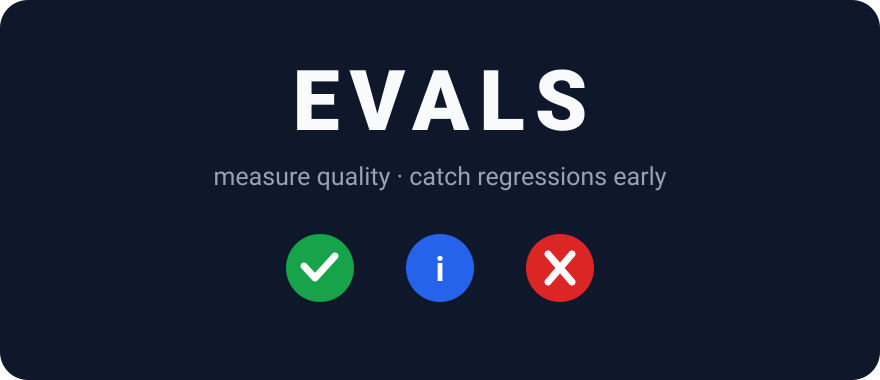
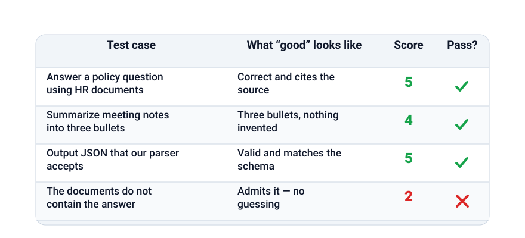
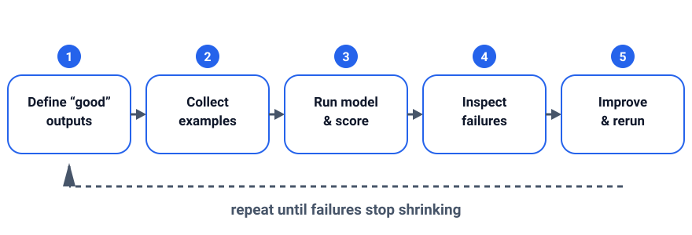

+++
date = '2026-09-06T09:00:00+07:00'
draft = false
title = 'How to evaluate AI quality: a practical intro to LLM evals'
description = 'Chatting with a model feels great, but feelings are not data. Learn how to build a small eval set, score answers, and catch quality regressions before your users do.'
summary = 'Turn "it feels worse" into a number: build a small eval set, score answers, and catch quality regressions before your users do.'
featured_image = 'cover.svg'
show_reading_time = true
+++

Try a chatbot and the first answer is often great. Then the model is updated or a prompt is tweaked, and the answers turn... off: less careful, more willing to invent things. Feelings are not data: demos show a few curated answers, while production serves hundreds of real questions. This post introduces LLM evals: a small test set, a simple scoring method, and a loop that shows real improvement.



*A minimal scoreboard turns "it feels worse" into a number you can compare.*

## Why evaluate at all

In a demo you pick the questions; in production, users do not cooperate. Questions arrive with typos, vague wording, and missing context, and models drift: a new version can fix long answers while breaking something else.

Without measurement, every change is a gamble, and users usually notice regressions first. An eval is a repeatable measurement: the same questions, scored the same way, rerun so each version can be compared with the previous one.

## What to measure

Measure four things.

- **Correctness**: are the facts right when a known answer exists?
- **Faithfulness**: does the answer stay grounded in the sources you provided, or drift into confident invention — the hallucination failure mode from my earlier post on [why AI hallucinates](/en/why-ai-hallucinates-and-how-to-handle-it/)?
- **Format and style**: does the output follow your rules for structure, length, tone, or language?
- **Edge cases**: how does it handle empty input, off-topic questions, unsafe requests, or unanswerable questions?

## Start with a small eval set

A few dozen examples, not thousands, catch most regressions; you grow the set over time.

Collect "golden" examples: real user questions, each with a note on what a good answer looks like. Cover three kinds of cases:

- **Happy path**: common questions the model should handle easily.
- **Edge cases**: empty input, ambiguous phrasing, and boundaries such as a length limit.
- **Adversarial cases**: attempts to confuse the model, leading questions that invite hallucination, and requests that should be refused.

Store each example so it can be reproduced; a plain text or JSON row suffices. When an answer fails, classify it: wrong fact, invented detail, ignored source, broken format, or unnecessary refusal — labels point to the fix.

## Scoring: simple and practical

Start simple: a score is a number you can compare.

- **Exact or contains match**: check that the output contains an expected number, name, or phrase. Brittle but nearly free.
- **Rubric 1–5**: describe each level briefly, read every answer, and assign a value. Slow but trustworthy.
- **LLM-as-judge**: a second model scores each answer with your rubric. Fast and scalable, but judges have biases: they often prefer longer answers. Calibrate on examples you scored by hand.
- **Human spot-checks**: read a sample yourself before shipping. A judge can be wrong like any model.

Run the automation on every change and spot-check a sample before each deploy.



*Example: a minimal scorecard comparing two models.*

In plain Python:

```python
row = {
    "prompt": "How many days do I have to return an item?",
    "expected": ["30 days"],
    "answer": "You have 30 days to return any item.",
}

def contains_score(row):
    text = row["answer"].lower()
    hits = [k for k in row["expected"] if k.lower() in text]
    return len(hits) / len(row["expected"])

eval_set = [row]  # grow this list over time

for case in eval_set:
    print(case["prompt"], contains_score(case))
```

## Run evals in a loop

An eval set pays off only when reused: change a prompt or model version, rerun the same set, and compare with the previous run.

This is the regression mindset of a test suite. If the overall score rises but an important case falls, accept the trade-off or add that case to the set so it never silently regresses again. Keep each run's scores in a file: "this feels better" becomes "four points higher on the same questions."



*Example: every change reruns the same eval set and compares the result with the previous run.*

## Key takeaways

- Feelings are not data: turn "it feels worse" into a repeatable score.
- Start with a few dozen golden examples covering happy path, edge cases, and adversarial cases.
- Measure faithfulness, not just correctness: fluent, unsupported answers are hallucinations.
- Score simply: exact or contains match, 1–5 rubrics, and an LLM-as-judge checked by humans.
- Rerun the same set on every change; each regression becomes a new eval case.

**Read next:** [grounding AI answers with RAG](/en/rag-guide/) and [writing better prompts](/en/prompt-engineering/).
