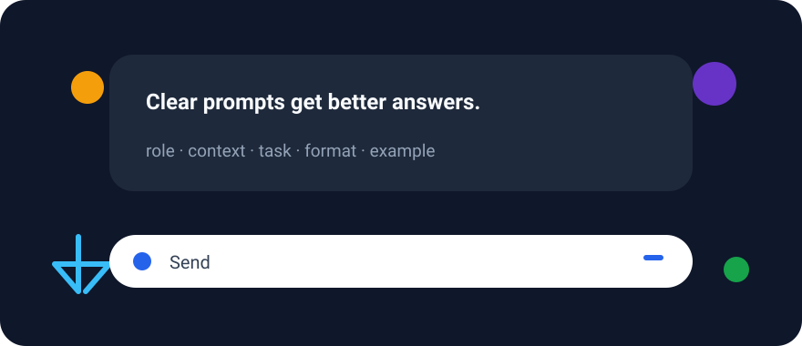
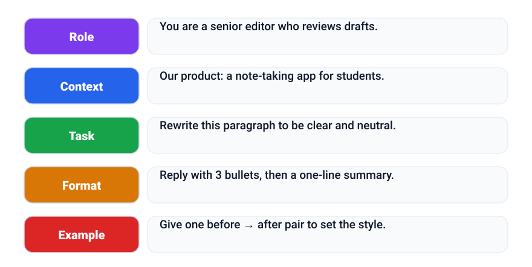
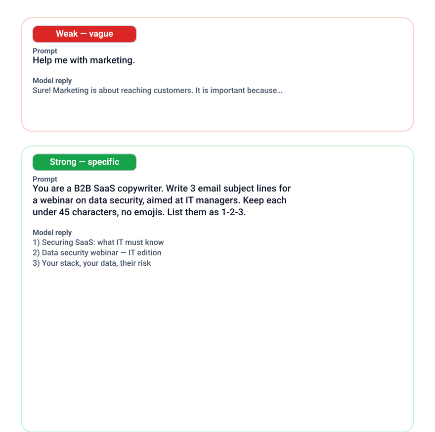

+++
date = '2026-09-08T09:00:00+07:00'
draft = false
title = 'Prompt engineering: how to talk to AI models clearly'
description = 'The same model gives very different answers depending on how you ask. Learn the building blocks of a good prompt — role, context, task, format, examples — and when prompting is not enough.'
summary = 'The same model answers very differently depending on how you ask. Learn the building blocks of a clear prompt — and when prompting is not enough.'
featured_image = 'cover.svg'
show_reading_time = true
+++

Ask for the same thing twice in slightly different words and you may get a vague answer one time, a sharp one the next. The model did not change — only the prompt did.

Prompt engineering is just writing clear instructions for AI models — no programming needed. A few habits improve the answers you get. Here is what makes a prompt work, what helps most, and when no prompt is enough.



*The model is the same — only the question changed.*

## Same model, very different answers

Wording matters because language models do not read requests like people. They predict the most likely continuation of the conversation, and your prompt is the strongest clue about what you want. “Write something about coffee” leaves the model to guess your audience, goal, and tone; “a short product description of this cold brew for busy office workers — friendly, not salesy” leaves little to guess. The clearer the starting point, the closer the answer lands to what you intended.

## The anatomy of a good prompt

The same few building blocks power most strong prompts:

- **Role** — who the model acts as.
- **Context** — what it knows, who reads the result.
- **Task** — one clear action.
- **Constraints** — length, tone, things to avoid.
- **Format** — the shape of the output.
- **Examples** — one or two samples to imitate.

A minimal template:

```text
Role:        {who the model acts as}
Context:     {what it knows; who reads the result}
Task:        {one clear action, e.g. rewrite the text}
Format:      {prose, bullets, a table, or JSON}
```



*These same ingredients power most strong prompts.*

## Techniques that work

**Be specific.** “Rewrite it shorter and friendlier, ending with one clear question” tells the model what “improve this email” means.



*Adding structure turns a weak request into a strong one.*

**Ask it to reason step by step.** For math, logic, or planning, this reduces careless mistakes and makes errors easier to spot.

**Give one or two examples.** A short sample beats a long description of the tone you want.

**Ask one thing at a time.** A prompt hiding three questions handles each superficially — split them.

**Ask it to self-check.** Tell it to reread its answer against your instructions and flag uncertainty.

## Ask for structure

Structure makes answers reusable. Output headed for a spreadsheet or an app? Ask for a table or JSON with named fields. Comparing options? Ask for short bullets. Grading text? Provide a rubric — what counts and how much — and a score per criterion. A final self-check also catches skipped fields and ignored constraints.

## Debug prompts like code

Most prompts are not perfect on the first attempt — that is normal. Treat them like code: change one variable at a time and keep the old output next to the new one. Change three things at once and you will not know which helped. A few rounds of small edits usually produce a version you can reuse.

## When prompting is not enough

Prompting improves how a model uses what it already knows; it cannot add missing knowledge. If answers about your own documents or recent data are wrong, no rewording fixes that — supply the material instead. Retrieval-augmented generation (RAG) adds relevant documents to the question so the answer can stay grounded in them.

Prompting also cannot tell you whether answers are good. If you reuse a prompt often, test it with evals — small cases with expected outcomes, run after each change — and keep a human in the loop for anything sensitive.

## Key takeaways

- Task, context, constraints, format — say them clearly.
- Be specific, add one or two examples, and ask for step-by-step reasoning.
- Ask for tables, JSON, or rubrics when the output will be reused — plus a self-check.
- Debug like code: change one variable at a time, compare outputs.
- Prompting cannot supply missing knowledge — use RAG — and never replaces human review.

## Read next

- [Evaluating AI quality](/en/llm-evals/)
- [Grounding answers with RAG](/en/rag-guide/)
