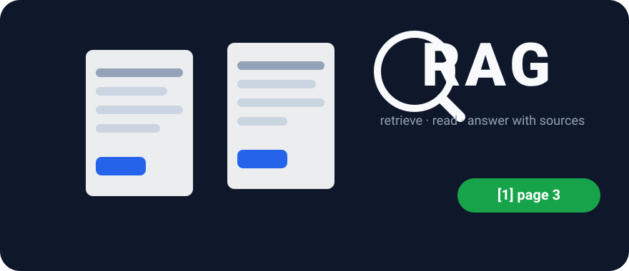
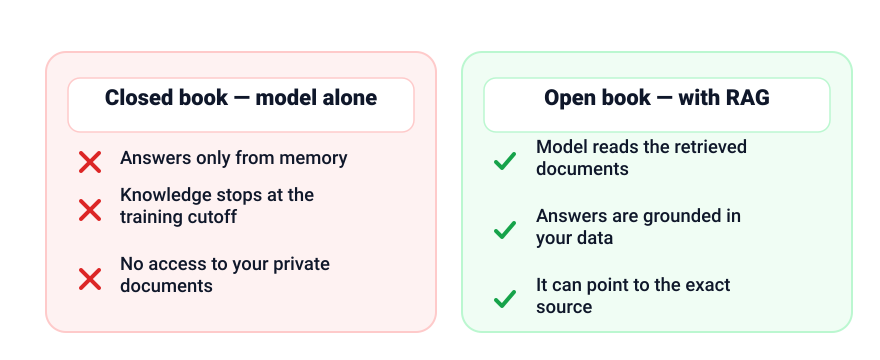
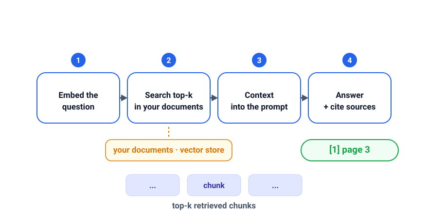

+++
date = '2026-09-07T09:00:00+07:00'
draft = false
title = 'RAG in practice: grounding AI answers in your own documents'
description = 'A language model only knows its training data. RAG lets it read your documents before answering — like an open-book exam. The pipeline, a minimal code sketch, and tuning tips.'
featured_image = 'cover.svg'
show_reading_time = true
+++

A model is like a brilliant student whose memory froze on graduation day: it only knows its training data and cannot see anything newer or private. Yet work questions usually concern documents that changed last week and were never public. Retrieval-Augmented Generation (RAG) fixes this: the model reads your documents before answering. Below: the idea, the pipeline, a code sketch, and the tuning levers.



*Cover: RAG grounds answers in the documents you own.*

## The problem: the model knows less than your company does

A model's knowledge is a snapshot of public text with a cutoff date; ask about anything newer and it answers from patterns, not knowledge. Company knowledge — policies, product docs, support tickets — is private, so it never enters the training data. Ask it about your own rules and, with no facts to recall, it produces a confident guess — hallucination in the making. The model is not broken; it was never given the information, and RAG closes that gap at answer time.

## RAG in one sentence: open-book exam, not closed-book

A closed-book exam asks a student to recall everything from memory; an open-book exam lets them flip through the textbook and answer from the page. RAG moves AI from the first camp to the second: before generating, it searches your documents, pulls out the most relevant passages, and places them in the prompt. The model still does the writing — it just reads first.



*Closed-book recall vs. open-book retrieval — different answers.*

## The pipeline in three stages

**Ingestion.** Split documents into chunks of a few hundred words, turn each into an embedding — numbers capturing its meaning — and store both in a vector store built for similarity search.

**Retrieval.** Embed the question the same way and ask the store for the top-k closest chunks.

**Generation.** Build a prompt from the question plus retrieved chunks, instructing the model to answer only from that context and to say when it has no answer.



*Ingest documents, retrieve the relevant chunks, generate from them.*

## A minimal end-to-end sketch

Only the details differ — embedding model, store, splitting — not the shape:

```python
# 1. Ingestion: split documents, embed chunks, store
for document in documents:
    for chunk in split_into_chunks(document):
        store.add(chunk, embed(chunk))   # chunk + its meaning vector

# 2. Retrieval: embed the question, search the top-k chunks
context = store.search(embed(question), top_k=5)

# 3. Generation: answer only from the retrieved context
prompt = f"""Answer using ONLY the context below.
If it has no answer, say you do not know. Cite the source chunk.

Context:
{context}

Question: {question}
"""
answer = llm.chat(prompt)
```

## Tuning tips

- **Chunk size.** Too small loses context; too large blurs the embedding. A few hundred words is a sane start.
- **Top-k.** More chunks means more material — and more distraction. Start small, adjust where errors appear.
- **Metadata filters.** Store name, type, and date with each chunk, filter before retrieval ("latest version only") to cut wrong answers.
- **Reranking.** Vector search is cheap but coarse; a reranker, a more careful second pass, improves precision.
- **Cite the source.** Ask the model to reference the chunk behind each claim, and show users where each answer came from.
- **Keep the index fresh.** Re-ingest changed documents so answers never come from an outdated version.
- **Measure retrieval separately.** Track whether the right chunk came back (retrieval) apart from whether the answer is good (generation).

## Honest limits

RAG reduces hallucination — the failure mode described in [Why AI hallucinates and how to handle it](/en/why-ai-hallucinates-and-how-to-handle-it/) — but it does not remove it. If retrieval misses the right chunk, the model quietly falls back to guessing. If the index is stale, the answer is confidently wrong about yesterday's rules. So the habit from that post stays: for answers that matter, a human checks the cited chunk against the claim. RAG makes grounded answers cheap; it does not make trust automatic.

## Key takeaways

- A model answers only from what it can see; RAG puts your documents in front of it first.
- Pipeline: ingest (chunk, embed, store), retrieve (top-k), generate (context plus a cite instruction).
- Tune chunk size, top-k, filters, and reranking; keep the index fresh.
- Measure retrieval and answer quality as separate metrics.
- RAG lowers hallucination risk; important claims still deserve a human check.

## Read next

Continue with related posts: [evaluating AI quality](/en/llm-evals/) and [writing better prompts](/en/prompt-engineering/).
