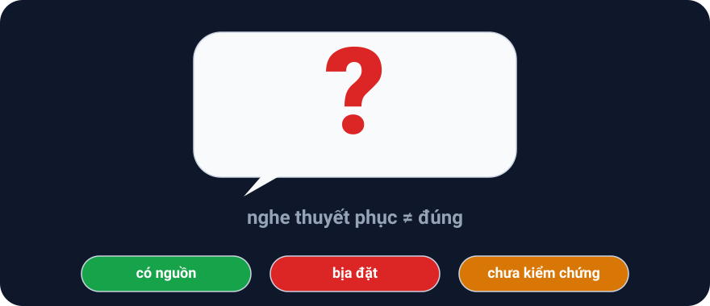
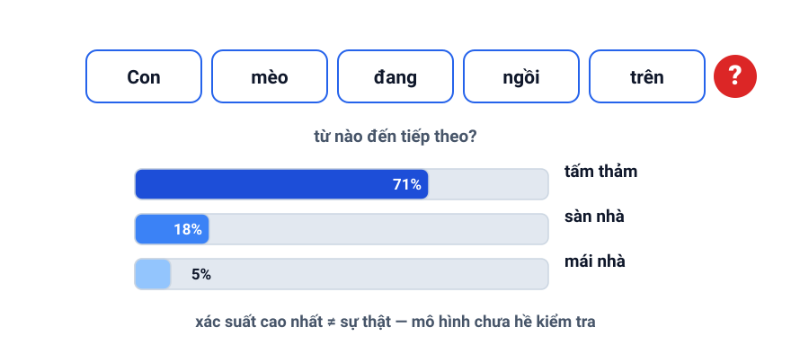
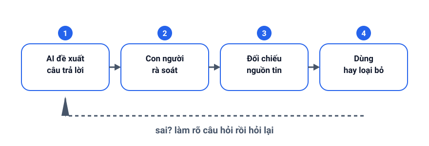

+++
date = '2026-09-05T21:10:32+07:00'
draft = false
aliases = ['/why-ai-hallucinates-and-how-to-handle-it/']
title = 'Tại sao AI hallucinates và giải quyết vấn đề này như thế nào?'
description = 'AI hallucinates vì nó đang dự đoán từ tiếp theo, không kiểm tra sự thật. Tìm hiểu nguyên nhân và cách giảm rủi ro khi dùng AI trong thực tế.'
summary = 'Vì sao AI đưa ra câu trả lời tự tin nhưng sai sự thật — và cách giảm rủi ro: nguyên nhân, ví dụ và các biện pháp thực tế.'
featured_image = 'cover.svg'
+++

AI ngày càng giỏi trong việc viết, tóm tắt và trả lời câu hỏi. Nhưng một trong những hạn chế lớn nhất của các mô hình ngôn ngữ hiện đại là chúng có thể tạo ra câu trả lời rất hợp lý nhưng sai sự thật. Hiện tượng này được gọi là hallucination.

Nói đơn giản, AI không phải lúc nào cũng “biết” điều gì là đúng. Nó đang dự đoán phần tiếp theo của câu trả lời dựa trên mẫu dữ liệu mà nó đã học. Vì thế, đôi khi nó “điền” thông tin bằng con đường hợp lý về mặt ngôn ngữ, dù không có căn cứ thực tế.

Trong bài viết này, mình sẽ giải thích vì sao AI hallucinates, nó xảy ra ở đâu, và làm thế nào để giảm rủi ro khi dùng AI trong thực tế.

*Câu trả lời tự tin chưa chắc là đúng — hãy kiểm tra nguồn.*

## Hallucination là gì?

Hallucination là khi AI tạo ra thông tin sai, thiếu căn cứ, mơ hồ hoặc không tồn tại, nhưng trình bày với giọng điệu rất tự tin.

Ví dụ điển hình:

- trích dẫn một nguồn không tồn tại
- nêu ra một sự kiện không có thật
- đưa ra một công thức hoặc con số sai
- trả lời câu hỏi chuyên môn nhưng không có dữ liệu hỗ trợ

Một mô hình AI không “đánh giá sự thật” như con người. Nó không có cảm giác về “đúng/sai” theo kiểu trực giác. Nó làm việc dựa trên xác suất và mô hình ngôn ngữ.

## Vì sao nó xảy ra?

### 1. AI đang dự đoán, không phải kiểm tra sự thật

Điều quan trọng nhất cần hiểu là: các mô hình ngôn ngữ lớn không hề “nhớ” tất cả thông tin như một người có trí nhớ. Chúng học cách dự đoán token tiếp theo trong một chuỗi văn bản.

Vì vậy, khi bạn hỏi một câu hỏi khó, AI sẽ tìm cách tạo ra câu trả lời có vẻ phù hợp nhất với dữ liệu mà nó đã thấy. Nếu không có thông tin rõ ràng, nó sẽ “điền” bằng một câu trả lời hợp lý về mặt ngôn ngữ.

*Mô hình chọn từ tiếp theo có xác suất cao nhất — nó không hề kiểm tra điều đó có đúng hay không.*

Đây là lý do vì sao AI dễ mắc lỗi khi:

- thiếu ngữ cảnh
- câu hỏi mơ hồ
- dữ liệu đầu vào thiếu rõ ràng
- chủ đề chuyên môn đòi hỏi nguồn đáng tin cậy

### 2. Dữ liệu huấn luyện không hoàn hảo

AI được huấn luyện trên khối lượng dữ liệu rất lớn, gồm web, sách, báo, mã nguồn, và nhiều loại nội dung khác. Nhưng dữ liệu đó không hoàn toàn đúng, không hoàn toàn mới, và cũng không luôn nhất quán.

Có những thông tin sai, tin đồn, đánh máy, hoặc suy diễn không chính xác trong dữ liệu gốc. Khi mô hình học từ nhiều nguồn cùng lúc, nó không luôn biết đâu là thật, đâu là sai.

Nói cách khác, AI không có “bộ lọc sự thật” tự động như một người nghiên cứu có kinh nghiệm.

### 3. Thiếu grounding

Grounding là việc gắn câu trả lời với một nguồn dữ liệu cụ thể, một tài liệu, một cơ sở dữ liệu hoặc một context thực tế.

Nếu mô hình không có truy cập tới dữ liệu gốc, nó sẽ phải suy đoán. Điều này tạo ra “hallucination” rất dễ xảy ra.

Ví dụ thực tế:

- Bạn hỏi AI về một báo cáo nội bộ chưa được cập nhật trên hệ thống
- AI không có dữ liệu đó, nhưng nó vẫn trả lời với thông tin nghe có vẻ hợp lý
- Kết quả là câu trả lời trở thành “sự suy đoán có vẻ chắc chắn”

### 4. Câu hỏi quá mơ hồ

Một câu hỏi không rõ ràng sẽ khiến AI dự đoán theo nhiều hướng khác nhau.

Ví dụ:

- “Hệ thống này có hiệu quả không?”
- “Nó có thể làm điều đó không?”
- “Sản phẩm này tốt chứ?”

Những câu hỏi này thiếu bối cảnh rõ ràng. AI có thể trả lời theo kiểu “có vẻ đúng” nhưng không có dữ liệu cụ thể để chứng minh.

## Vì sao AI lại nói rất tự tin?

Bởi vì mô hình được tối ưu hóa để tạo ra câu trả lời mượt, rõ ràng và có cấu trúc tốt. Câu trả lời đó thường có vẻ “đã được kiểm chứng”, dù thực tế chỉ là một suy luận xác suất.

Đây là một điểm rất nguy hiểm: AI không thiếu sự chắc chắn về mặt hình thức, nhưng lại thiếu độ tin cậy về mặt dữ liệu.

Nói cách khác, nó có thể nói rất trôi chảy, nhưng không phải lúc nào cũng đúng.

## Hallucination có đáng sợ không?

Tùy vào lĩnh vực mà mức độ nguy hiểm khác nhau.

### Trong nội dung marketing

AI có thể viết slogan, bài blog, mô tả sản phẩm rất tốt, nhưng lại nói sai về thông tin, số liệu, hoặc tính năng thực tế.

### Trong y tế và pháp lý

Rủi ro rất lớn. Một câu trả lời sai trong lĩnh vực nhạy cảm có thể gây hậu quả nghiêm trọng.

### Trong lập trình và phân tích dữ liệu

AI có thể tạo ra đoạn code hoặc báo cáo có vẻ đúng nhưng lại sai logic, thiếu trường hợp biên, hoặc không dựa trên đúng nguồn dữ liệu.

### Trong công việc hằng ngày

Điều nguy hiểm nhất là bạn cảm thấy AI “đã hiểu” và tin quá mức. Khi đó, bạn có thể bỏ qua việc xác minh, đánh giá và kiểm tra.

## Làm sao để giảm rủi ro khi dùng AI?

### 1. Đừng tin AI tuyệt đối

Đây là nguyên tắc quan trọng nhất. AI nên được xem như một trợ lý mạnh, không phải người ra quyết định cuối cùng.

### 2. Yêu cầu AI tham chiếu nguồn

Nếu AI đang trả lời một câu hỏi quan trọng, hãy yêu cầu:

- nguồn dữ liệu
- link tham khảo
- lý do vì sao kết luận được đưa ra
- mức độ chắc chắn của câu trả lời

### 3. Dùng RAG hoặc dữ liệu nền

RAG (Retrieval-Augmented Generation) là cách cho AI truy cập vào dữ liệu thực tế trước khi trả lời. Khi đó, mô hình có thể dựa trên tài liệu thực và ít “đoán” hơn.

Ví dụ:

- AI đọc tài liệu nội bộ
- AI truy vấn database
- AI tra cứu báo cáo, policy, hoặc guide có sẵn

### 4. Yêu cầu AI chỉ ra mức độ chắc chắn

Thay vì hỏi “đúng không?”, hãy hỏi:

- “Theo dữ liệu bạn có, mức độ chắc chắn là bao nhiêu?”
- “Bạn có nguồn nào để xác nhận không?”
- “Nếu không có nguồn, hãy nói rõ rằng đây là suy đoán.”

### 5. Có quy trình kiểm tra người dùng

Đây là phần quan trọng nhất trong thực tế:

- AI tạo ra ý tưởng
- con người kiểm tra
- đối chiếu với nguồn
- xác nhận lại bằng thực tế

Nói cách khác, AI nên là công cụ hỗ trợ suy nghĩ, không thay thế kiểm tra của con người.

*Trước khi tin kết quả: AI đề xuất, con người đối chiếu nguồn, rồi chấp nhận hoặc loại bỏ.*

## Một cách hiểu đơn giản

AI hallucinates giống như một người đang viết rất nhanh nhưng không luôn dừng lại để kiểm tra sự thật. Nó không phải cố ý nói dối; nó đang tạo ra một câu trả lời có vẻ hợp lý dựa trên mô hình thống kê của ngôn ngữ.

Vấn đề là: sự “hợp lý” không phải lúc nào cũng đồng nghĩa với “đúng”.

## Kết luận

Hallucination không phải lỗi ngẫu nhiên, mà là hệ quả của cách các mô hình AI hoạt động. Chúng được tối ưu hóa để dự đoán, không phải để kiểm tra sự thật ở mọi trường hợp.

Điều quan trọng không phải là “tránh dùng AI hoàn toàn”, mà là:

- hiểu giới hạn của nó
- kiểm tra thông tin
- yêu cầu căn cứ
- và đặt AI vào vị trí hỗ trợ, không phải quyết định cuối cùng

Khi bạn dùng AI đúng cách, nó sẽ trở thành một công cụ mạnh mẽ. Khi bạn tin nó mọi thứ, bạn đang đặt mình vào nguy cơ bị dẫn dắt bởi những câu trả lời nghe rất hợp lý nhưng sai thực tế.

Đó chính là lý do vì sao việc hiểu hallucination là kỹ năng quan trọng trong thời đại AI.

## Đọc tiếp

Bài này mở đầu một chuỗi bài ngắn về cách dùng AI an toàn trong thực tế. Đọc tiếp:

- [Đánh giá chất lượng AI](/vi/evals/llm-evals/) — biến "cảm giác sai sai" thành điểm số đo được
- [RAG thực hành](/vi/rag/rag-guide/) — gắn câu trả lời AI vào tài liệu của bạn
- [Prompt engineering](/vi/prompting/prompt-engineering/) — viết chỉ dẫn rõ ràng hơn

## Nguồn tham khảo

- IBM. "What is AI hallucination?" https://www.ibm.com/think/topics/ai-hallucinations
- Microsoft Learn. Azure OpenAI FAQ — "When I ask the model a question about something that happened recently before the knowledge cutoff and it got the answer wrong. Why does this happen?" https://learn.microsoft.com/en-us/azure/ai-services/openai/faq

Những nguồn trên đều nhấn mạnh một điểm chung: mô hình ngôn ngữ tạo ra câu trả lời dựa trên mẫu dữ liệu và xác suất, nên không phải lúc nào cũng đúng; việc có grounding, kiểm chứng và con người ở vòng lặp xác minh là cách giảm rủi ro hallucination.
