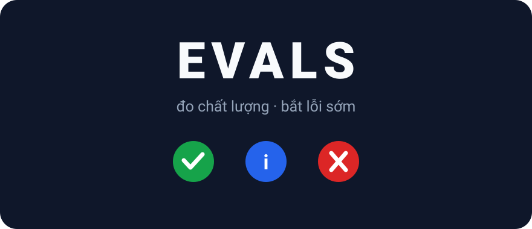
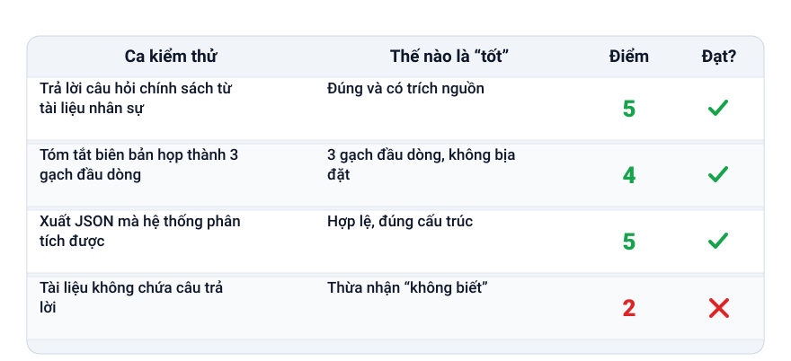
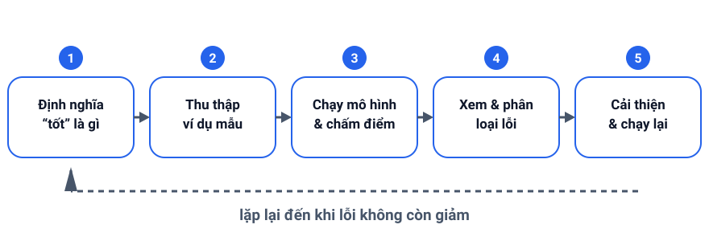

+++
date = '2026-09-06T09:00:00+07:00'
draft = false
aliases = ['/llm-evals/']
title = 'Đánh giá chất lượng AI: nhập môn LLM evals thực hành'
description = 'Trò chuyện với mô hình thì rất thích, nhưng cảm xúc không phải là dữ liệu. Tìm hiểu cách xây một bộ eval nhỏ, chấm điểm câu trả lời và phát hiện chất lượng đi xuống trước khi người dùng gặp phải.'
summary = 'Biến "cảm giác tệ hơn" thành con số: xây bộ eval nhỏ, chấm điểm câu trả lời và bắt kịp chất lượng đi xuống trước khi người dùng gặp phải.'
featured_image = 'cover.svg'
show_reading_time = true
+++

Thử một chatbot hiện đại, bạn sẽ có trải nghiệm quen thuộc: câu trả lời đầu tiên thường rất hay. Rồi mô hình được cập nhật, hoặc bạn sửa prompt một chút, và các câu trả lời bắt đầu... tệ dần: kém cẩn thận hơn, sẵn sàng bịa chuyện hơn. Cảm xúc không phải là dữ liệu: một buổi demo chỉ cho bạn vài câu trả lời được chọn lọc, còn môi trường thực tế phải phục vụ hàng trăm câu hỏi thật. Bài này giới thiệu LLM evals: một bộ câu hỏi kiểm tra nhỏ, một cách chấm điểm đơn giản và một vòng lặp giúp bạn thấy mô hình có thực sự tiến bộ hay không.



*Một bảng điểm tối giản biến "cảm giác tệ hơn" thành một con số để so sánh.*

## Vì sao phải đánh giá?

Khi demo, bạn tự chọn câu hỏi; còn khi đưa vào thực tế, người dùng không "hợp tác" như vậy. Câu hỏi đến với lỗi chính tả, diễn đạt mơ hồ và thiếu ngữ cảnh, và mô hình cũng "trôi" theo thời gian: một phiên bản mới có thể sửa câu trả lời dài nhưng lại âm thầm làm hỏng việc khác.

Không có phép đo, mỗi thay đổi là một canh bạc, và người nhận ra chất lượng đi xuống đầu tiên thường là người dùng. Eval đơn giản là một phép đo lặp lại: cùng những câu hỏi, cùng cách chấm điểm, chạy đi chạy lại để so sánh phiên bản mới với phiên bản trước.

## Nên đo những gì?

Bắt đầu với bốn thứ.

- **Độ đúng (correctness)**: câu trả lời có nêu đúng sự thật khi có đáp án rõ ràng không?
- **Faithfulness**: câu trả lời có bám sát nguồn bạn cung cấp, hay trôi dạt vào những phát biểu tự tin nhưng không có căn cứ? Đây chính là failure mode hallucination mà mình đã viết trong bài [vì sao AI hallucinates](/vi/daily-tips/why-ai-hallucinates-and-how-to-handle-it/).
- **Định dạng và phong cách**: đầu ra có tuân theo quy tắc của bạn về cấu trúc, độ dài, giọng văn hay ngôn ngữ không?
- **Edge cases**: mô hình xử lý thế nào với đầu vào rỗng, câu hỏi lạc đề, yêu cầu không an toàn, hay những câu không thể trả lời?

## Bắt đầu với một bộ eval nhỏ

Vài chục ví dụ, không cần tới hàng nghìn, đã đủ bắt được hầu hết các regression; bạn sẽ mở rộng bộ này dần theo thời gian.

Hãy thu thập các ví dụ "golden": những câu hỏi thật của người dùng, mỗi câu kèm ghi chú về một câu trả lời tốt trông như thế nào. Bao phủ ba loại tình huống:

- **Happy path**: những câu hỏi phổ biến mà mô hình nên xử lý dễ dàng.
- **Edge cases**: đầu vào rỗng, diễn đạt mơ hồ và các ranh giới như giới hạn độ dài.
- **Adversarial cases**: cố tình làm mô hình rối, câu hỏi dẫn dắt khiến mô hình hallucinate, hoặc những yêu cầu đáng lẽ phải từ chối.

Lưu mỗi ví dụ sao cho có thể tái tạo lại được; một dòng text hoặc JSON đơn giản là đủ. Khi một câu trả lời sai, hãy phân loại lỗi: sai sự thật, bịa chi tiết, bỏ qua nguồn, sai định dạng, hay từ chối không đáng có. Những nhãn như vậy giúp bạn biết đúng chỗ cần sửa, thay vì chỉ nhận ra mơ hồ rằng "hôm nay AI tệ".

## Chấm điểm: đơn giản và thực dụng

Hãy bắt đầu đơn giản: điểm số chỉ là một con số để so sánh.

- **Khớp chính xác hoặc chứa từ khóa**: với câu trả lời có hình dạng rõ ràng, kiểm tra xem đầu ra có chứa con số, tên hay cụm từ mong đợi không. Mong manh nhưng gần như miễn phí.
- **Rubric 1–5**: viết ngắn gọn mô tả từng mức điểm, đọc từng câu trả lời rồi cho điểm. Chậm nhưng đáng tin.
- **LLM-as-judge**: dùng một mô hình thứ hai chấm từng câu trả lời theo rubric của bạn. Nhanh và mở rộng được, nhưng "giám khảo" cũng có thiên kiến — chúng thường thích câu trả lời dài hơn — nên hãy hiệu chỉnh trên những ví dụ bạn đã tự chấm.
- **Con người kiểm tra mẫu**: dù tự động hóa nói gì, hãy tự đọc một mẫu trước khi phát hành. Giám khảo cũng có thể sai như bất kỳ mô hình nào.

Tự động hóa chạy ở mỗi thay đổi, và bạn kiểm tra mẫu bằng tay trước mỗi lần triển khai.



*Ví dụ: một bảng điểm tối giản so sánh hai mô hình.*

Trong Python thuần, chỉ cần một dictionary và một vòng lặp ngắn:

```python
row = {
    "prompt": "How many days do I have to return an item?",
    "expected": ["30 days"],
    "answer": "You have 30 days to return any item.",
}

def contains_score(row):
    text = row["answer"].lower()
    hits = [k for k in row["expected"] if k.lower() in text]
    return len(hits) / len(row["expected"])

eval_set = [row]  # thêm dần các trường hợp mới vào đây

for case in eval_set:
    print(case["prompt"], contains_score(case))
```

## Chạy eval thành vòng lặp

Một bộ eval chỉ phát huy tác dụng khi được dùng đi dùng lại: thay đổi prompt hoặc phiên bản mô hình, chạy lại đúng bộ câu hỏi đó, rồi so sánh điểm với lần chạy trước.

Đây chính là tư duy regression, giống như bộ test trong phần mềm. Nếu điểm tổng tăng nhưng một trường hợp quan trọng giảm, hãy chấp nhận đánh đổi hoặc thêm trường hợp đó vào bộ eval để nó không bao giờ âm thầm tụt lại nữa. Hãy lưu điểm từng lần chạy vào một file đơn giản: "cảm giác tốt hơn" sẽ trở thành "cao hơn bốn điểm trên cùng một bộ câu hỏi".



*Ví dụ: mỗi thay đổi chạy lại cùng một bộ eval và so sánh kết quả với lần chạy trước.*

## Điểm chính

- Cảm xúc không phải là dữ liệu: hãy biến "cảm giác tệ hơn" thành một điểm số lặp lại được.
- Bắt đầu nhỏ: vài chục ví dụ golden trải khắp happy path, edge cases và adversarial cases.
- Đo faithfulness chứ không chỉ đo độ đúng: câu trả lời trôi chảy nhưng không có căn cứ chính là hallucination.
- Chấm điểm đơn giản trước: khớp chính xác hoặc chứa từ khóa, rubric 1–5, và LLM-as-judge có con người kiểm tra.
- Chạy lại cùng một bộ eval ở mỗi thay đổi; mỗi regression trở thành một ví dụ eval mới.

**Đọc tiếp:** [RAG thực hành](/vi/rag/rag-guide/) và [prompt engineering](/vi/prompting/prompt-engineering/).
