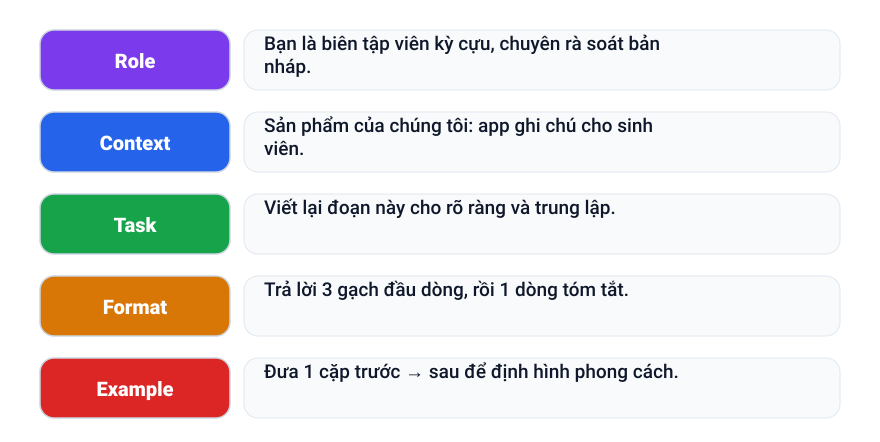
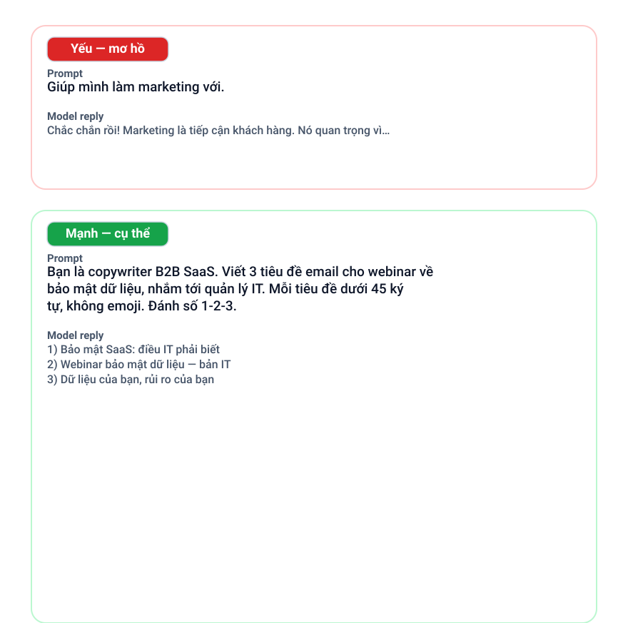

+++
date = '2026-09-08T09:00:00+07:00'
draft = false
aliases = ['/prompt-engineering/']
title = 'Prompt engineering: cách “ra lệnh” rõ ràng cho AI'
description = 'Cùng một mô hình nhưng câu trả lời có thể rất khác nhau tùy vào cách bạn hỏi. Tìm hiểu các thành phần của một prompt tốt — vai trò, bối cảnh, nhiệm vụ, định dạng, ví dụ — và khi nào chỉ viết prompt thôi là chưa đủ.'
summary = 'Cùng một mô hình trả lời rất khác nhau tuỳ cách bạn hỏi. Tìm hiểu cấu trúc của một prompt rõ ràng — và khi nào prompt là chưa đủ.'
featured_image = 'cover.svg'
show_reading_time = true
+++

Chắc bạn từng gặp cảnh này: hỏi cùng một việc theo hai cách hơi khác nhau, lần đầu nhận câu trả lời chung chung, lần sau lại rõ ràng và đúng trọng tâm. Mô hình không hề thay đổi — chỉ có cách bạn hỏi thay đổi.

Prompt engineering đơn giản là biết viết chỉ dẫn rõ ràng cho mô hình AI — không cần biết lập trình. Vài thói quen nhỏ sẽ giúp câu trả lời bạn nhận được tốt hơn hẳn. Trong bài viết này, mình sẽ nói về điều gì tạo nên một prompt tốt, kỹ thuật nào hiệu quả nhất, và khi nào viết prompt thế nào cũng không đủ.


*Mô hình vẫn vậy — chỉ có câu hỏi thay đổi.*

## Cùng một mô hình, câu trả lời rất khác nhau

Cách diễn đạt quan trọng vì mô hình ngôn ngữ không đọc yêu cầu như con người. Chúng dự đoán đoạn tiếp theo có khả năng xuất hiện nhất trong hội thoại, và prompt của bạn là gợi ý rõ nhất về điều bạn muốn. Nói “viết gì đó về cà phê” thì mô hình phải tự đoán đối tượng, mục đích và giọng văn của bạn; nói “một đoạn mô tả ngắn về ly cold brew này cho dân văn phòng bận rộn — thân thiện, không quá quảng cáo” thì gần như không còn gì phải đoán. Điểm xuất phát càng rõ, câu trả lời càng gần điều bạn định nói.

## Cấu trúc của một prompt tốt

Các prompt mạnh hầu hết được tạo nên từ vài thành phần giống nhau:

- **Vai trò** — mô hình đóng vai ai.
- **Bối cảnh** — mô hình biết gì, ai sẽ đọc kết quả.
- **Nhiệm vụ** — một hành động rõ ràng.
- **Ràng buộc** — độ dài, giọng văn, những điều cần tránh.
- **Định dạng** — hình dạng của đầu ra.
- **Ví dụ** — một hoặc hai mẫu để mô hình bắt chước.

Một mẫu prompt tối giản:

```text
Vai trò:     {mô hình đóng vai ai}
Bối cảnh:    {mô hình biết gì; ai đọc kết quả}
Nhiệm vụ:    {một hành động rõ ràng, ví dụ viết lại văn bản}
Định dạng:   {đoạn văn, gạch đầu dòng, bảng hay JSON}
```



*Những thành phần này tạo nên hầu hết các prompt mạnh.*

## Những kỹ thuật thực sự hiệu quả

**Hãy cụ thể.** “Viết lại ngắn gọn và thân thiện hơn, kết thúc bằng một câu hỏi rõ ràng” cho mô hình biết “cải thiện email này” nghĩa là gì.



*Thêm cấu trúc biến một yêu cầu mơ hồ thành một yêu cầu rõ ràng.*

**Yêu cầu mô hình suy luận từng bước.** Với tính toán, logic hay lập kế hoạch, cách này giảm bớt lỗi cẩu thả và giúp bạn dễ phát hiện chỗ sai.

**Đưa một hoặc hai ví dụ.** Một mẫu ngắn hiệu quả hơn một đoạn mô tả dài về giọng văn bạn muốn.

**Mỗi lần chỉ hỏi một việc.** Prompt giấu ba câu hỏi thường nhận câu trả lời xử lý hời hợt từng câu — hãy tách chúng ra.

**Yêu cầu mô hình tự kiểm tra.** Bảo nó rà soát lại câu trả lời với chỉ dẫn ban đầu và nói rõ khi không chắc chắn.

## Yêu cầu đầu ra có cấu trúc

Cấu trúc giúp câu trả lời dùng lại được. Đầu ra sắp được đưa vào bảng tính hay ứng dụng? Hãy yêu cầu bảng hoặc JSON với các trường có tên rõ ràng. Đang so sánh các phương án? Hãy yêu cầu gạch đầu dòng ngắn. Đang chấm điểm văn bản? Hãy đưa mô hình một rubric — tiêu chí nào tính điểm và tính bao nhiêu — rồi yêu cầu chấm điểm từng tiêu chí. Bước tự kiểm tra cuối cùng cũng giúp bắt những lỗi như bỏ sót trường hay bỏ qua ràng buộc.

## Sửa prompt như sửa code

Hầu hết prompt không hoàn hảo ngay lần đầu — điều đó bình thường. Hãy coi nó như code: mỗi lần chỉ đổi một biến và để câu trả lời cũ cạnh câu trả lời mới. Đổi ba thứ cùng lúc thì bạn không biết thứ nào có ích. Vài vòng chỉnh sửa nhỏ thường cho ra một bản dùng lại được.

## Khi nào chỉ viết prompt là chưa đủ

Prompt giúp mô hình dùng tốt hơn những gì nó đã biết; nó không thể thêm kiến thức mà mô hình chưa có. Nếu câu trả lời về tài liệu riêng hay dữ liệu mới của bạn cứ sai, viết lại prompt thế nào cũng không khắc phục được — hãy đưa tài liệu cho mô hình. Retrieval-Augmented Generation (RAG) bổ sung các tài liệu liên quan bên cạnh câu hỏi để câu trả lời bám được vào nguồn thật.

Prompt cũng không thể cho bạn biết câu trả lời có tốt hay không. Nếu bạn dùng một prompt thường xuyên, hãy kiểm tra bằng evals — những trường hợp nhỏ có kết quả mong đợi, chạy lại sau mỗi thay đổi — và luôn giữ con người trong vòng kiểm tra với những việc nhạy cảm.

## Điểm chính

- Nhiệm vụ, bối cảnh, ràng buộc, định dạng — hãy nói rõ ràng.
- Càng cụ thể, kèm một hai ví dụ và yêu cầu suy luận từng bước.
- Yêu cầu bảng, JSON hay rubric khi bạn sẽ dùng lại kết quả — kèm bước tự kiểm tra.
- Sửa prompt như sửa code: mỗi lần đổi một biến rồi so sánh.
- Prompt không thể thêm kiến thức mô hình chưa có — hãy dùng RAG — và không bao giờ thay thế việc con người kiểm tra lại.

## Đọc tiếp

- [Đánh giá chất lượng AI](/vi/evals/llm-evals/)
- [RAG thực hành](/vi/rag/rag-guide/)
