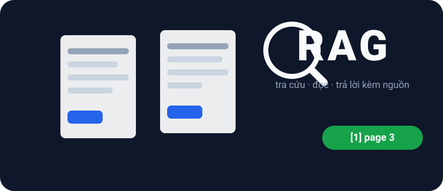
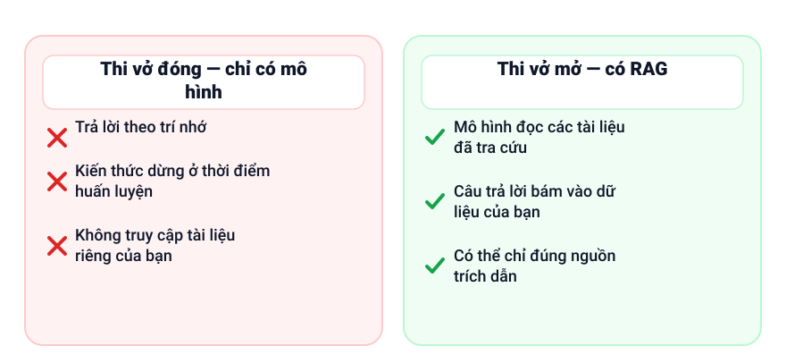
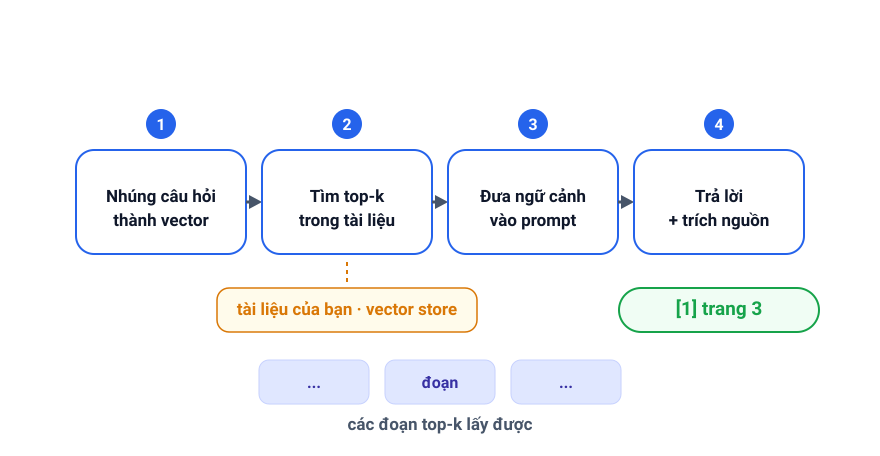

+++
date = '2026-09-07T09:00:00+07:00'
draft = false
title = 'RAG thực hành: gắn câu trả lời AI vào tài liệu của bạn'
description = 'Mô hình ngôn ngữ chỉ biết dữ liệu mà nó được huấn luyện. RAG cho AI đọc tài liệu của bạn trước khi trả lời — giống như một kỳ thi mở sách. Các bước của pipeline, một đoạn code tối giản và mẹo tinh chỉnh.'
featured_image = 'cover.svg'
show_reading_time = true
+++

Mô hình ngôn ngữ giống như một học sinh xuất sắc mà trí nhớ bị đóng băng từ ngày tốt nghiệp: nó chỉ biết dữ liệu huấn luyện của mình và không thể thấy gì mới hơn — hay bất cứ điều gì riêng tư. Trong khi đó, những câu hỏi trong công việc thường lại xoay quanh tài liệu vừa thay đổi tuần trước và chưa bao giờ công khai. Retrieval-Augmented Generation (RAG) khắc phục điều này: mô hình đọc tài liệu của bạn trước khi trả lời. Dưới đây, mình sẽ đi qua: ý tưởng chính, các giai đoạn của pipeline, một đoạn code tối giản và những nút vặn quan trọng khi tinh chỉnh.



*Ảnh bìa: RAG gắn câu trả lời vào tài liệu mà bạn sở hữu.*

## Vấn đề: mô hình biết ít hơn cả công ty của bạn

Kiến thức của mô hình là một tấm ảnh chụp văn bản công khai tại một thời điểm, và tấm ảnh đó có ngày hết hạn; hỏi bất cứ điều gì mới hơn, nó trả lời theo mẫu dự đoán, chứ không phải từ kiến thức. Kiến thức của một công ty — chính sách nội bộ, tài liệu sản phẩm, ticket hỗ trợ — là dữ liệu riêng tư, nên không bao giờ đi vào dữ liệu huấn luyện. Hỏi nó về chính quy định của bạn, không có thông tin nào để nhớ lại, nó sẽ đưa ra một câu trả lời tự tin — hallucination đang hình thành. Mô hình không hề hỏng; chỉ là nó chưa bao giờ được cung cấp thông tin đó, và RAG lấp khoảng trống này ngay lúc trả lời.

## RAG trong một câu: thi mở sách, không phải thi đóng sách

Thi đóng sách yêu cầu học sinh nhớ mọi thứ trong đầu; thi mở sách cho phép mở giáo trình ra và trả lời dựa trên những gì nằm trên trang giấy. RAG đưa AI từ kiểu thi thứ nhất sang kiểu thi thứ hai: trước khi sinh câu trả lời, nó tìm trong tài liệu của bạn, lấy ra những đoạn liên quan nhất rồi đặt vào prompt. Mô hình vẫn là người viết — nó chỉ đọc trước đã.



*Trả lời theo trí nhớ (đóng sách) so với tra tài liệu rồi trả lời (mở sách) — cùng một câu hỏi, kết quả rất khác nhau.*

## Pipeline gồm ba giai đoạn

**Nạp dữ liệu (ingestion).** Chia tài liệu thành các chunk vài trăm từ, biến mỗi chunk thành một embedding — dãy số mô tả ý nghĩa của nó — rồi lưu cả hai vào một vector store chuyên tìm kiếm theo độ tương đồng.

**Truy xuất (retrieval).** Mã hóa câu hỏi bằng cùng mô hình embedding, rồi nhờ vector store trả về top-k chunk gần nghĩa nhất.

**Sinh câu trả lời (generation).** Ghép câu hỏi với các chunk truy xuất được thành một prompt, yêu cầu mô hình chỉ trả lời dựa trên ngữ cảnh đó và nói rõ khi ngữ cảnh không có câu trả lời.



*Nạp tài liệu, truy xuất các đoạn liên quan, rồi sinh câu trả lời từ đó.*

## Một đoạn code tối giản cho cả pipeline

Chỉ có chi tiết là khác nhau — embedding model nào, vector store nào, chia chunk ra sao — còn hình dáng chung thì không đổi:

```python
# 1. Nạp dữ liệu: chia tài liệu thành chunk, embedding, lưu trữ
for document in documents:
    for chunk in split_into_chunks(document):
        store.add(chunk, embed(chunk))   # chunk + vector ý nghĩa của nó

# 2. Truy xuất: mã hóa câu hỏi, tìm top-k chunk gần nhất
context = store.search(embed(question), top_k=5)

# 3. Sinh câu trả lời: chỉ trả lời dựa trên ngữ cảnh truy xuất được
prompt = f"""Chỉ trả lời dựa trên ngữ cảnh bên dưới.
Nếu ngữ cảnh không có câu trả lời, hãy nói rằng bạn không biết.
Trích dẫn chunk nguồn cho từng khẳng định.

Ngữ cảnh:
{context}

Câu hỏi: {question}
"""
answer = llm.chat(prompt)
```

## Mẹo tinh chỉnh

- **Kích thước chunk.** Quá nhỏ thì mất ngữ cảnh; quá lớn thì làm embedding mờ đi. Vài trăm từ mỗi chunk là điểm khởi đầu hợp lý.
- **Top-k.** Càng nhiều chunk thì càng nhiều chất liệu — nhưng cũng càng dễ phân tâm. Bắt đầu nhỏ rồi điều chỉnh theo chỗ sai.
- **Lọc theo metadata.** Lưu tên, loại và ngày của tài liệu cùng mỗi chunk, lọc trước khi truy xuất ("chỉ bản mới nhất") để loại bỏ những câu trả lời sai.
- **Reranker.** Tìm kiếm vector ở lượt đầu rẻ nhưng thô; một reranker, mô hình cẩn thận hơn chạy lượt hai, sẽ cải thiện độ chính xác.
- **"Trích dẫn nguồn."** Yêu cầu mô hình chỉ rõ chunk đứng sau mỗi khẳng định và cho người dùng thấy nguồn của từng câu trả lời.
- **Giữ index luôn mới.** Nạp lại những tài liệu đã thay đổi để câu trả lời không bao giờ đến từ một bản cũ.
- **Đo retrieval riêng, đo chất lượng câu trả lời riêng.** Theo dõi xem chunk đúng có được trả về không (retrieval) tách khỏi việc câu trả lời có tốt không (generation).

## Giới hạn thật lòng

RAG làm giảm hallucination — lỗi mà bài [Tại sao AI hallucinates](/vi/why-ai-hallucinates-and-how-to-handle-it/) đã mô tả — chứ không xóa bỏ nó. Nếu truy xuất bỏ lỡ chunk đúng, mô hình lặng lẽ quay lại kiểu đoán. Nếu index đã cũ, câu trả lời sẽ tự tin nhưng sai về quy định của hôm qua. Vì vậy, thói quen từ bài đó vẫn giữ nguyên: với những câu trả lời quan trọng, con người vẫn phải đối chiếu chunk được trích dẫn với khẳng định. RAG giúp tạo ra câu trả lời có căn cứ một cách rẻ và dễ; nó không biến việc tin tưởng thành điều tự động.

## Điểm chính

- Mô hình chỉ trả lời được những gì nó nhìn thấy; RAG đặt tài liệu của bạn trước mặt nó trước tiên.
- Pipeline có ba giai đoạn: nạp (chunk, embedding, lưu trữ), truy xuất (top-k), sinh câu trả lời (prompt kèm ngữ cảnh và yêu cầu trích dẫn).
- Hãy tinh chỉnh kích thước chunk, top-k, bộ lọc metadata và reranker — và giữ index luôn mới.
- Đo chất lượng truy xuất và chất lượng câu trả lời thành hai chỉ số riêng biệt.
- RAG giảm rủi ro hallucination, nhưng thông tin quan trọng vẫn đáng để con người kiểm tra lại.

## Đọc tiếp

Tiếp tục với các bài liên quan: [đánh giá chất lượng AI](/vi/llm-evals/) và [prompt engineering](/vi/prompt-engineering/).
